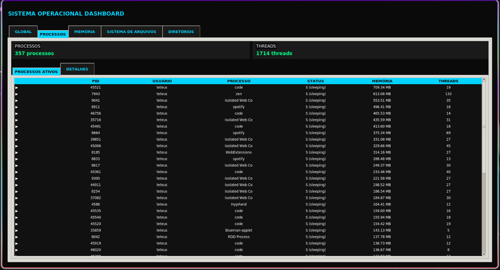

# Operating System Dashboard

Interactive dashboard for monitoring Linux operating system resources.

## Features
- Real-time visualization of CPU, memory, processes and threads usage
- Listing of main processes and their threads
- Disk partitions and file system monitoring
- Directory navigation and file details display
- File search by name pattern

## Project Structure
- `main.py`: application initialization
- `controller/`: control logic and data updates
- `model/`: system, process and file information collection
- `view/`: graphical interface (Tkinter + Matplotlib)

## Requirements
- Python 3.11+
- Linux (uses /proc filesystem)
- Libraries: tkinter, matplotlib

## Installation and Setup

1. **Install uv** (if not already installed):
```bash
curl -LsSf https://astral.sh/uv/install.sh | sh
```

2. **Create and activate virtual environment**:
```bash
uv venv
source .venv/bin/activate
```

3. **Install dependencies**:
```bash
uv sync --all-groups
```

## Running the Application
```bash
python main.py
```

## Screenshots

### Global System Overview

*Overview of system resources including CPU and memory usage*

### Memory Monitoring

*Detailed memory usage visualization and statistics*

### Process Management

*Process list with detailed information about running processes*

### Directory Navigation

*File system navigation and directory browsing interface*

### File System Archives

*File system monitoring and archive management*

## Notes
- The dashboard uses only Python standard libraries and matplotlib
- It's recommended to run with appropriate permissions to access all system data
- This application is designed specifically for Linux systems using the /proc filesystem

## License

For academic use in the Data Communication course.
